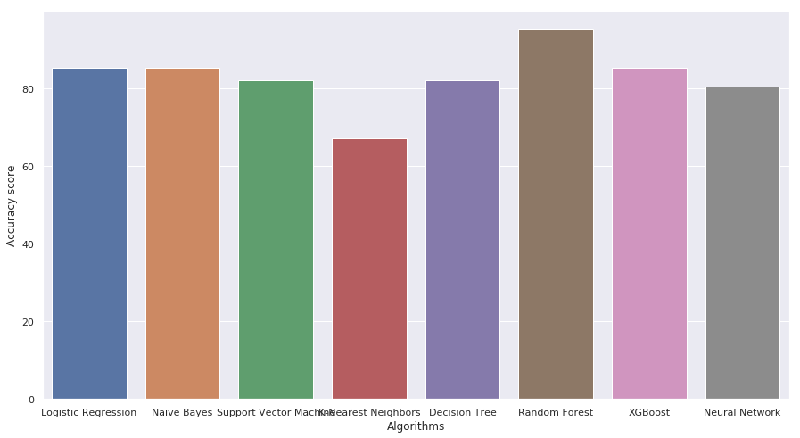

# Heart Disease Prediction Project

This Python script is designed to predict the likelihood of heart disease based on various medical attributes. The project's objective is to provide a tool that can assist healthcare professionals in identifying individuals who are at risk of developing heart conditions. By leveraging machine learning algorithms, the script analyzes medical data to generate predictions, allowing for early intervention and personalized healthcare strategies.

## Overview

The script begins by reading a dataset from a CSV file containing anonymized medical records of patients, including attributes such as age, gender, cholesterol levels, blood pressure, and various diagnostic test results. It then performs exploratory data analysis (EDA) to gain insights into the dataset's structure, distribution, and correlations between variables. Visualization techniques, including histograms, scatter plots, and correlation matrices, are utilized to understand the data better.

Following EDA, the script preprocesses the data by handling missing values, encoding categorical variables, and splitting the dataset into training and testing sets. Several machine learning algorithms are then employed for classification, including Logistic Regression, Naive Bayes, Support Vector Machine (SVM), K-Nearest Neighbors (KNN), Decision Tree, Random Forest, XGBoost, and Neural Network. Each algorithm's performance is evaluated using metrics such as accuracy, precision, recall, and F1-score.

The script concludes by presenting the accuracy scores of each algorithm and visualizing the results using a bar plot. Additionally, insights gained from the analysis, such as feature importance and correlations with the target variable, are discussed to provide further context.

## Objective

Heart disease is a leading cause of morbidity and mortality worldwide, making early detection and intervention critical for improving patient outcomes. The objective of this project is to develop a predictive model that can accurately identify individuals at risk of heart disease based on their medical history and clinical parameters. By leveraging advanced machine learning techniques, the goal is to create a tool that healthcare professionals can use to assess patients' risk profiles and tailor preventive measures accordingly.

## Files

- **heart.csv**: The dataset containing health-related information used for training and testing the predictive models.

- **main.py**: The main Python script implementing data analysis, model training, and evaluation.

## Requirements

Make sure you have the following libraries installed:

- NumPy
- Pandas
- Matplotlib
- Seaborn
- Scikit-learn
- XGBoost
- TensorFlow (for Keras Neural Network)
  
You can install the required packages using the following command:

```bash
pip install numpy pandas matplotlib seaborn scikit-learn xgboost tensorflow
```

# Instructions

### Clone the Repository:

```bash
https://github.com/MankaranRooprai/heart-disease-predictor.git
```

### Run the Script:

```bash
python main.py
```

# Results

The script generates accuracy scores for different machine learning models, including:

- Logistic Regression
- Naive Bayes
- Support Vector Machine
- K-Nearest Neighbors
- Decision Tree
- Random Forest
- XGBoost
- Neural Network

The final accuracy scores are visualized using a barplot.
The highest accuracy is using Random Forest at 88.52%.



# Important Notes

- The dataset contains information about individuals, including age, sex, chest pain type, and other health-related factors.
- The "target" column in the dataset indicates the presence (1) or absence (0) of heart disease.
- The Neural Network model's accuracy can be improved by adjusting hyperparameters, such as the number of epochs and nodes in the hidden layers.
- Make sure to install the required packages listed in the Requirements section before running the script.

# Acknowledgments

- The dataset, code, and graph(s) used in this project is sourced from https://github.com/g-shreekant/Heart-Disease-Prediction-using-Machine-Learning/tree/master.
- Special thanks to the developers of scikit-learn, XGBoost, and TensorFlow for their contributions to machine learning libraries.

Feel free to explore and modify the script for further analysis or improvement of predictive models.
